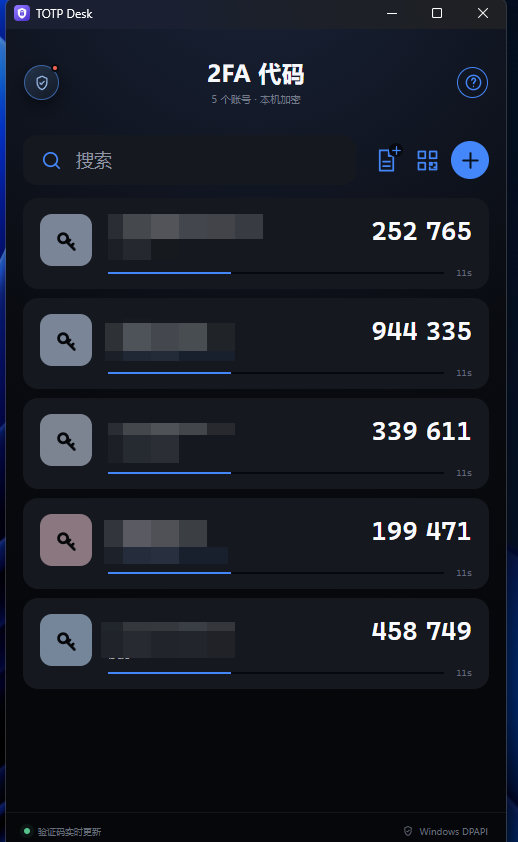

# TOTP Desk

[简体中文](README.md) | [English](README_EN.md)

TOTP Desk is a lightweight, offline TOTP authenticator for Windows, built with Rust, Tauri 2, and native TypeScript.

## Screenshot

<p align="center">
  
</p>

## Features

- Add Base32 seeds manually
- Batch-import seeds, `otpauth://totp` URIs, and `otpauth-migration://` URIs
- Scan QR codes using a camera, an image file, or a clipboard screenshot
- Capture a screen or application window and detect QR codes locally
- Import JSON backups
- Export a single account or the complete account collection
- Edit and delete existing accounts
- Click anywhere on an account card to copy its current code
- Automatic code and countdown refresh
- SHA-1, SHA-256, and SHA-512 support
- Six-digit and eight-digit TOTP codes
- Per-user encryption at rest using Windows DPAPI
- No secret persistence in the web frontend
- Rust secret buffers are cleared with `zeroize`
- Release builds use LTO, a single codegen unit, and `panic = "abort"`

## Privacy and Security

TOTP Desk works entirely offline. It does not upload account information, secret seeds, screenshots, or generated codes.

The local `accounts.dat` database is encrypted with Windows DPAPI for the current Windows user. It cannot normally be decrypted after being copied to a different user account or computer.

Exported JSON backups contain Base32 seeds in plaintext so they can be migrated to another installation. Treat these files as sensitive credentials and store them in an encrypted location or a trusted password manager.

Decrypted TOTP secrets must briefly exist in process memory while codes are generated. Rust-side secret buffers are cleared with `zeroize` when dropped. Operating-system crash dumps, compromised administrator accounts, malware, and other already-compromised environments are outside the application's security boundary.

## Requirements

- Windows 10 or Windows 11, x64
- Microsoft Edge WebView2 Runtime
- Node.js for frontend development
- Rust 1.97.1 with the MSVC target
- Visual Studio C++ Build Tools for native Windows builds

The Rust version and target are pinned in `rust-toolchain.toml`.

Check the installed toolchain:

```bash
rustc --version
cargo --version
```

Avoid old Rust and Cargo packages from Ubuntu's `apt` repositories, as they may be unable to compile current dependencies.

## Native Windows Build

Install the Visual Studio C++ Build Tools workload named **Desktop development with C++**, then run:

```powershell
rustup update
rustup default stable-msvc
npm ci
npm run tauri build
```

Generated bundles are placed under:

```text
src-tauri/target/release/bundle/
```

For frontend development:

```powershell
npm ci
npm run tauri dev
```

## Cross-compile a Windows Build from WSL Ubuntu

Tauri can use `cargo-xwin` to cross-compile the MSVC target from Linux. For better filesystem performance, keep the build copy in the WSL Linux filesystem, such as `~/src/totp-desk`, instead of compiling directly under `/mnt/c`.

Install the required system packages:

```bash
sudo apt update
sudo apt install -y curl build-essential clang lld llvm nsis pkg-config libssl-dev
```

If Rust or Cargo was installed through `apt`, remove the old packages and install Rust through `rustup`:

```bash
sudo apt remove -y cargo rustc
curl --proto '=https' --tlsv1.2 -sSf https://sh.rustup.rs | sh
source "$HOME/.cargo/env"
rustup update
```

Install the Windows target and `cargo-xwin`:

```bash
rustup target add x86_64-pc-windows-msvc
cargo install --locked cargo-xwin
```

Install the frontend dependencies and build the NSIS package:

```bash
npm ci
npm run tauri build -- \
  --runner cargo-xwin \
  --target x86_64-pc-windows-msvc \
  --bundles nsis
```

The generated installer is placed under:

```text
src-tauri/target/x86_64-pc-windows-msvc/release/bundle/nsis/
```

Cross-platform Tauri builds are experimental. They are not recommended for producing MSI packages and do not automatically apply a Windows code signature. If `cargo-xwin`, the Windows SDK, NSIS, or a native dependency fails, prefer a native Windows environment or a Windows GitHub Actions runner.

## Backup Format

The application can export one account or all accounts as a portable JSON backup. The backup contains plaintext Base32 seeds and must be protected accordingly.

The encrypted local database is intentionally tied to the current Windows user through DPAPI and is not intended to be copied between systems. Use JSON export and import for migration.

## Technology

- Rust
- Tauri 2
- TypeScript
- Vite
- Windows DPAPI
- WebView2

## Release Files

Release builds may be distributed in two forms:

- NSIS installer: `TOTP-Desk_<version>_x64-setup.exe`
- Portable executable: `TOTP-Desk_<version>_x64-portable.exe`

Unsigned development releases may trigger a Microsoft Defender SmartScreen warning. Production releases should be signed with a trusted Windows code-signing certificate.
